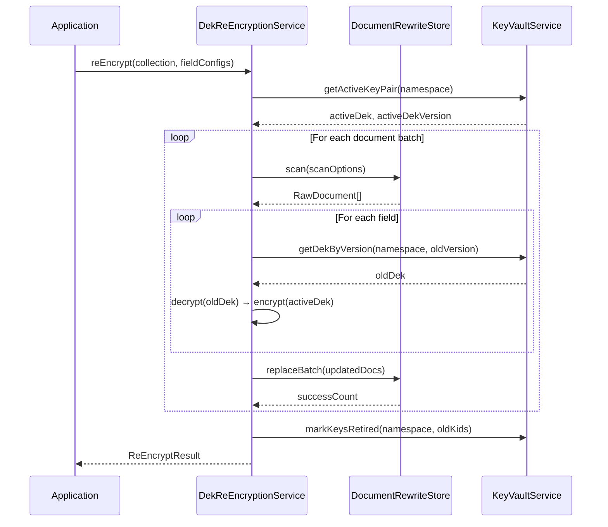

# Key Lifecycle Guide

LightCrypto-Link provides three complementary key lifecycle operations, each with different scope, cost, and use cases.

## Overview

| Operation | Scope | Cost | Downtime | When to Use |
|-----------|-------|------|----------|-------------|
| CMK Re-wrap | Vault only | O(keys) — seconds | None | CMK rotation, KMS provider migration |
| DEK Rotation | Vault only | O(1) — instant | None | Periodic DEK rotation (new writes use new DEK) |
| DEK Re-encryption | All documents | O(documents) — hours | None (CAS) | Retire old DEK material, compliance (PCI-DSS 8.2.4) |

## CMK Re-wrap

**What it does:** Re-wraps all DEK/HMAC keys in the vault under a new CMK provider. Does NOT change DEK material or touch business data.

**When to use:**
- Rotating the CMK in your KMS (Azure Key Vault, Alibaba KMS)
- Migrating between KMS providers

```javascript
const { KeyVaultService, AzureKmsProvider } = require('lightcrypto-link-node');

const targetProvider = new AzureKmsProvider({ /* new CMK config */ });
const result = await keyVaultService.rewrapVault(namespace, targetProvider);
// result: { namespace, success, skipped, dryRun, keyCount, error, durationMicros }
```

## DEK Rotation

**What it does:** Generates a new DEK/HMAC key pair and marks it ACTIVE. Old keys become ROTATED (still usable for decryption). Only affects future writes.

**When to use:**
- Periodic rotation policy (e.g., quarterly)
- After a suspected key compromise (rotate immediately, then re-encrypt)

```javascript
await keyVaultService.rotateDek(namespace);
// New writes now use v2; existing data still encrypted with v1
```

## DEK Re-encryption

**What it does:** Scans all documents, decrypts each encrypted field with the old DEK, re-encrypts with the active DEK, recomputes blind indexes, and writes back with CAS protection.

**When to use:**
- After DEK rotation, to migrate all existing data to the new DEK
- Before destroying old key material (compliance requirement)
- Enables safe key retirement: `ACTIVE → ROTATED → RETIRED → pruned`

```javascript
const { DekReEncryptionService, MongoDocumentRewriteStore } = require('lightcrypto-link-node');

const rewriteStore = new MongoDocumentRewriteStore({ db });
const service = new DekReEncryptionService({
  keyVaultService,
  storageAdapter,
  rewriteStore,
  eventBus
});

const fieldConfigs = [
  { path: 'phone', namespace: 'default.default.User#phone', blindIndex: true, blindIndexFieldName: 'phone' },
  { path: 'email', namespace: 'default.default.User#email', blindIndex: true, blindIndexFieldName: 'email' }
];

const result = await service.reEncrypt('users', fieldConfigs, {
  taskId: 'migration-2026-07',
  batchSize: 500,
  dryRun: false
});
// result: { namespace, docsProcessed, docsSkipped, docsFailed, fieldsReEncrypted, durationMicros, dryRun }
```

## Key Status Lifecycle

```
ACTIVE → ROTATED → RETIRED → (pruned/deleted)
```

- **ACTIVE**: Current key used for new encryptions
- **ROTATED**: Previous key, still used for decryption of historical data
- **RETIRED**: All data migrated, key can be safely deleted
- **Pruned**: Key entry permanently removed from vault

### Retirement Flow

```javascript
// 1. Rotate DEK (v1 → ROTATED, v2 → ACTIVE)
await keyVaultService.rotateDek(namespace);

// 2. Re-encrypt all documents (v1 data → v2)
const result = await service.reEncrypt('users', fieldConfigs);

// 3. On success, old keys are automatically marked RETIRED
//    (or manually: await keyVaultService.markKeysRetired(namespace, ['v1-abcd']))

// 4. Prune retired keys when ready (operational decision)
const pruned = await keyVaultService.pruneRetiredKeys(namespace);
```

## Concurrency & Safety

- **CAS Protection**: Re-encryption uses `_k` field CAS — if an application writes concurrently, the re-encryption skip that document (no data loss)
- **Checkpoint Resume**: Long-running tasks can resume from interruption via `taskId`
- **No Downtime**: Application reads/writes continue normally during re-encryption
- **Multiple Runs**: If CAS skip rate is high (heavy write load), run again to converge

## Sequence Diagram


